# Instalasi Mininet pada Instance EC2 AWS
- Name and tags: Tugas Akhir
- OS Images: Ubuntu Server 22.04 LTS 64 bit
- Instance type: t2.medium
- Key pair: vockey
- Edit Network settings: allow SSH, allow HTTP, allow HTTPS, allow TCP port 8080, allow TCP port 8081
- Configure storage: 30 GiB, gp3

## Membuat Instance EC2 AWS
1. Masuk pada halaman aws console, lalu pilih Launch a virtual machine with EC2. 
2. Memilih AMI Ubuntu Server 22.04 LTS 64 bit. 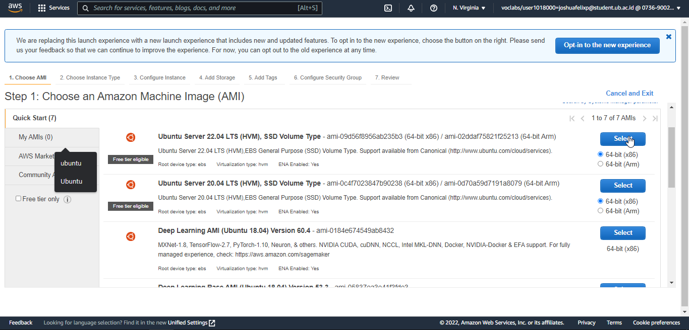
4. Memilih instance dengan tipe t2.medium. 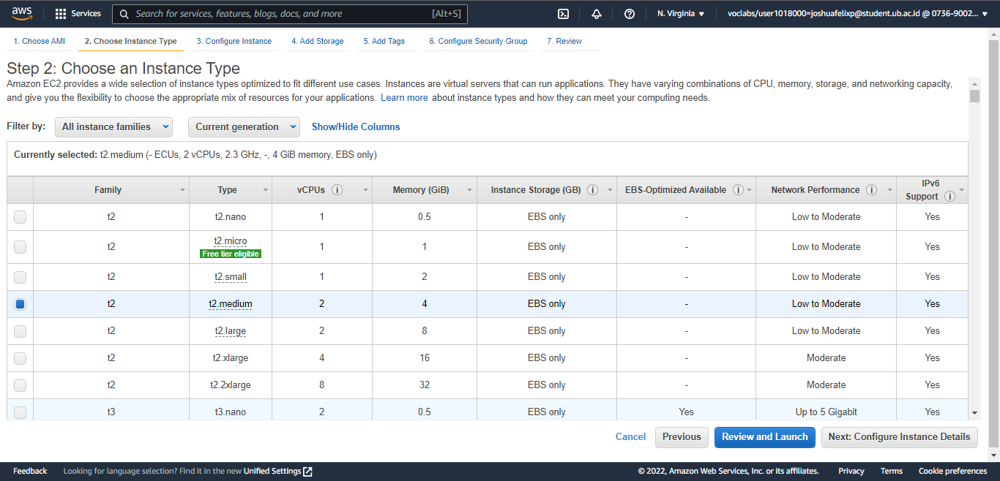
5. Pada Configure Instance Details gunakan konfigurasi default. 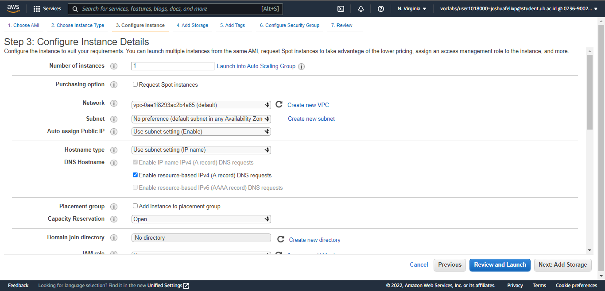
6. Mengubah size menjadi 30 dan Volume Type General Purpose SSD (gp3). 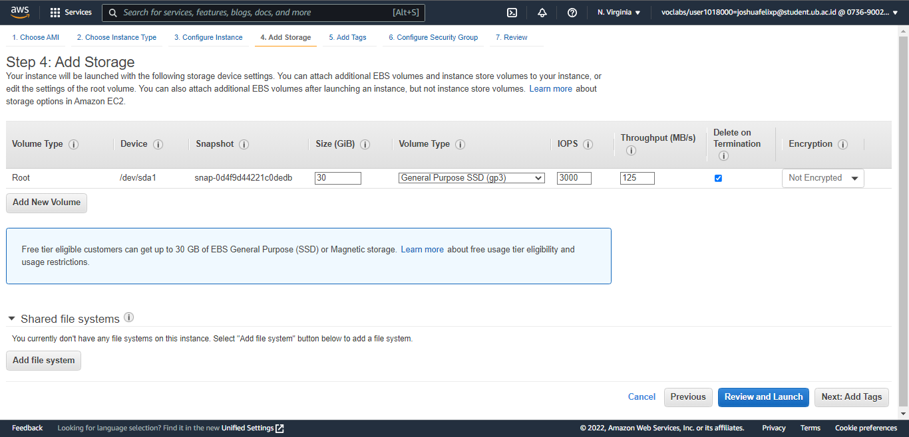
7. Memasukkan Tags dengan Key:Name dan Value:Tugas Akhir. 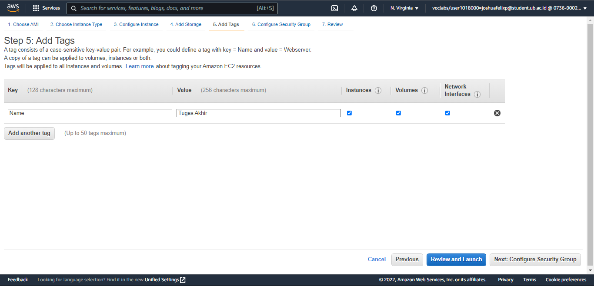
8. Pilih Create new security group dan beri nama Mininet, kemudian buka protocol SSH, HTTP, HTTPS, TCP port 8080, TCP port 8081. 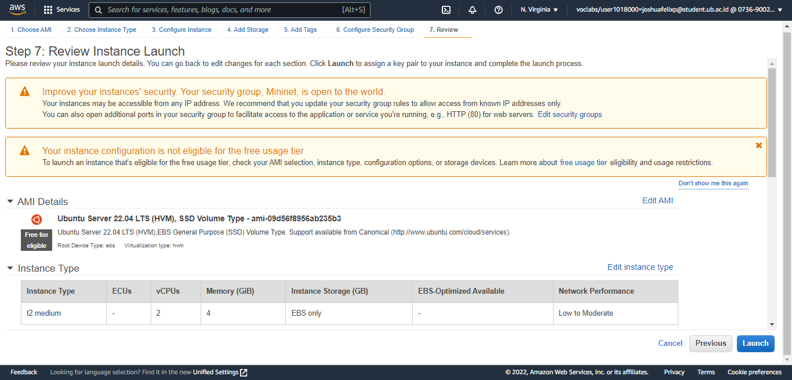
9. Pilih Choose an existing key pair, dan piih vockey | RSA, kemudian centang I acknowledge dan klik Launch Instances. 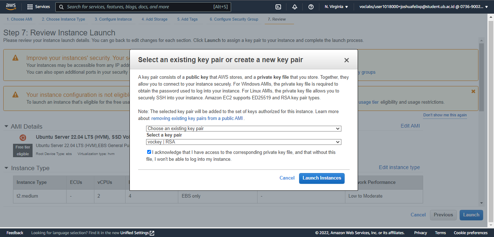
10. (Optional) Masuk pada halaman Elastic IPs untuk membuat IP statis agar IP EC2 tidak berubah. 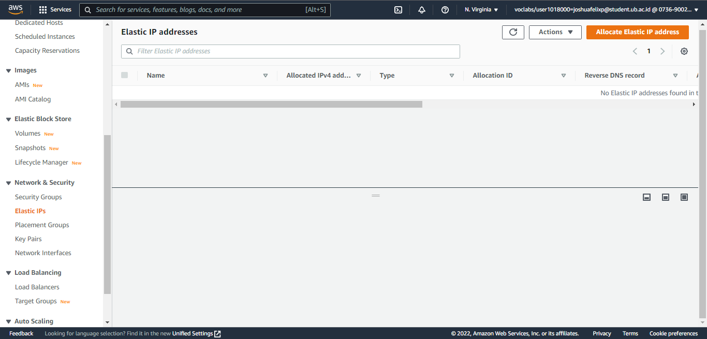
11. (Optional) Klik Allocate Elastic Ip address, dan isikan seperti di bawah. 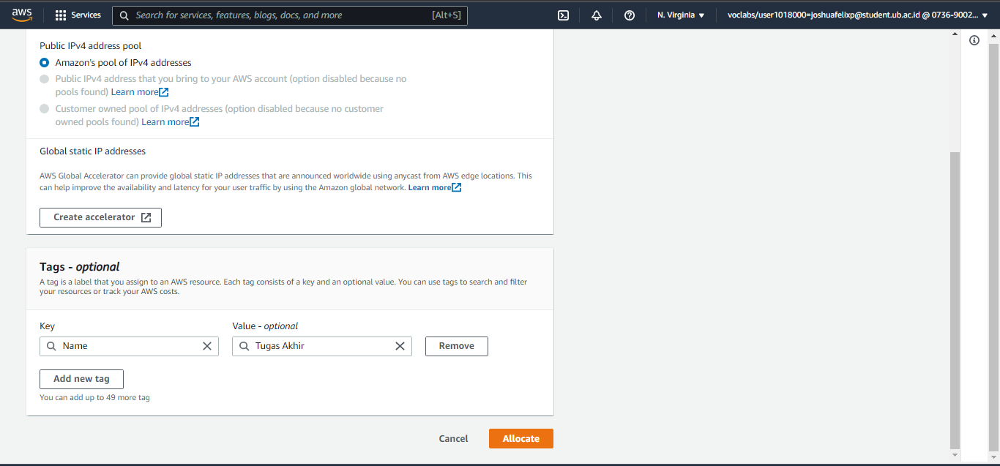
12. (Optional) Pilih Elastic Ip address yang telah dibuat kemudian klik Actions, Associate Elastic Ip address. 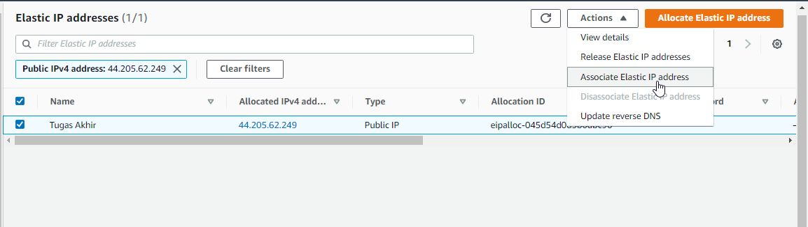
13. (Optional) Pilih Instance Tugas Akhir, kemudian klik Associate. 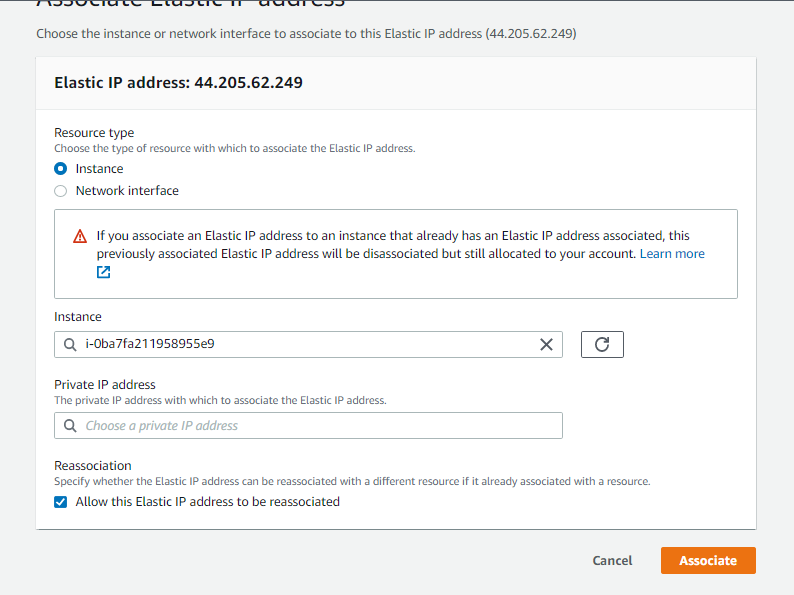

## Instalasi Mininet, Ryu Controller, dan Flow Manager pada Instance EC2
1. Masuk ke instance melalui terminal menggunakan IP public.
```sh
ssh -i .ssh/labsuser.pem ubuntu@ip-instance
```
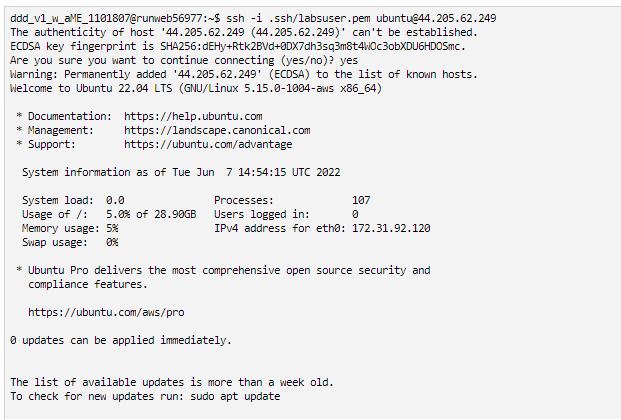

2. Melakukan update dan upgrade sistem ubuntu.
```sh
sudo apt -yy update && sudo apt -yy upgrade
```
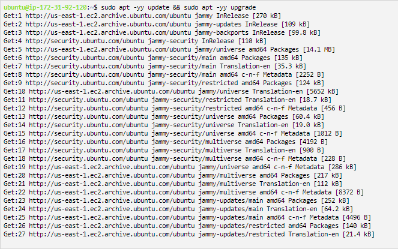

3. Mengunduh repositori Mininet.
```sh
git clone https://github.com/mininet/mininet
```
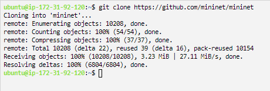

4. Install Mininet.
```sh
mininet/util/install.sh -nfv
```
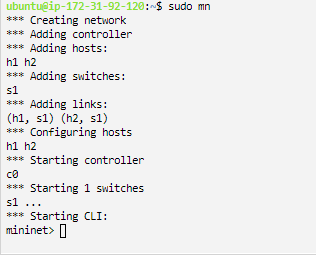

5. Unduh repository Ryu dan melakukan instalasi git clone https://github.com/osrg/ryu.git
cd ryu; pip install .
cd
```sh
sudo apt -yy update && sudo apt -yy upgrade
```


6. Unduh repository Flow Manager git clone https://github.com/martimy/flowmanager
cd

7. Mencoba menjalankan mininet dengan membuat topologi default yang terdiri atas 2
host dengan 1 switch dan 1 OpenFlow reference controller, menggunakan perintah sudo mn
8. Mencoba perintah dasar help untuk melihat perintah apa saja yang ada dalam Mininet.
9. Mencoba perintah dasar nodes untuk menampilkan nodes yang ada.
10. Mencoba perintah dasar net untuk menampilkan links yang ada.
11. Mencoba perintah dasar dump untuk menampilkan informasi semua nodes yang ada.
. Mencoba melakukan tes koneksi antar host menggunakan perintah pingall
